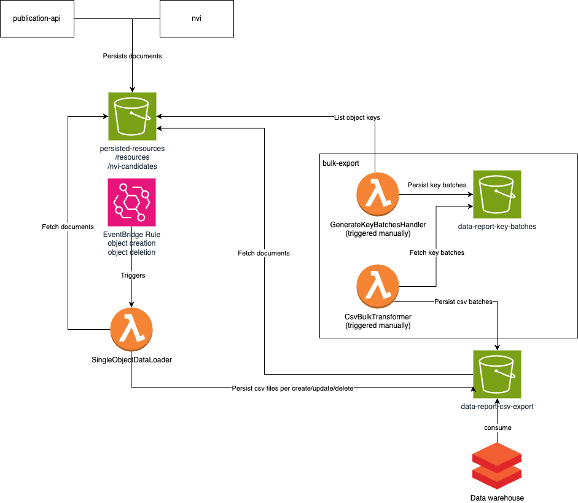
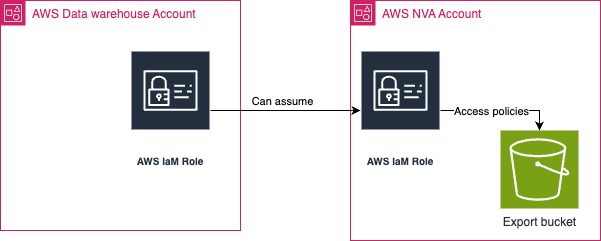

# NVA Data Report API

This repository contains functions for generating csv reports of data from NVA.
See [reportTypes](documentation/reportTypes.md) for a list of reports and data types.

## Architectural overview:

)

## Integration overview:

The s3 bucket `data-report-csv-export-{accountName}` (defined in template) is set up as a data
source in Databricks (in another AWS account) following
databricks [guide _Create a storage credential for connecting to AWS S3_](https://docs.databricks.com/en/connect/unity-catalog/storage-credentials.html#create-a-storage-credential-for-connecting-to-aws-s3).
This is how the data platform accesses files from `data-report-csv-export-{accountName}`:

## How-to guides:

- [Run bulk export](documentation/bulkExport.md)
